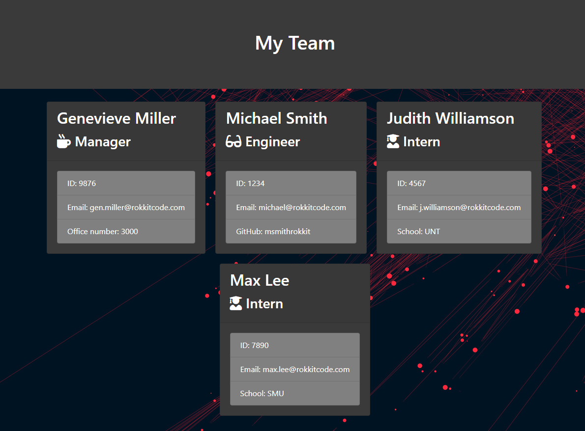
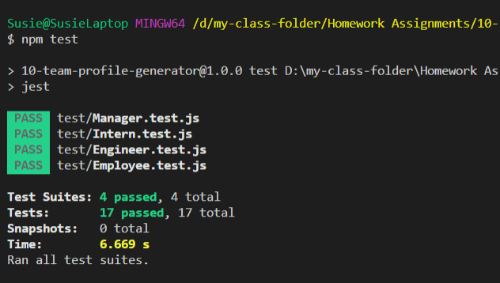
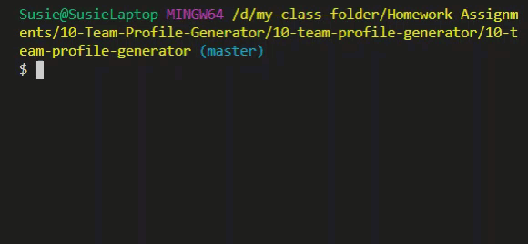
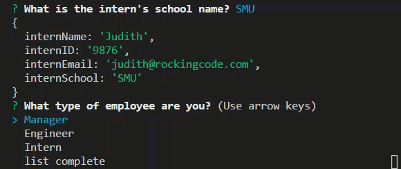

# Team Profile Generator

## Table of Contents

- [Description](#description)
- [Installation](#installation)
- [Tests](#tests)
- [Questions](#questions)
- [Demo](#demo)
- [License](#license)

## Description

This application will generate a web page of a company or project team. The web page that is generated displays an the employee summary portal, which includes the following:

- Manager

- Engineer

- Intern

With important contact information as their name, employee id and their email address.

There are more information returned depending on their title and the information entered when running the application:

- Manager includes an phone number

- Engineer includes a github name

- Intern includes a school name

The application builds a team with one manager and as many engineers and interns as you have.

## Installation

To use this application:

- Clone the GitHub repository at: <https://github.com/susieotto/10-team-profile-generator>

- All the packages should be included, but if you should get any errors, run `npm install`, `npm install inquirer`, `npm install fs` & `npm install colors`

- To run the application in command line, run `node app.js`

- You will be prompted to enter one manager and as many engineers and interns as you need to

- Choose 'list complete' when you are finished adding team members

- The resulting html file appears in an output directory as "output.html"
Example of Finsihed Team Profile:

- There is a style.css file included with the example styling above, but you may use your own design to fit your needs.

## Tests

To run the tests type in the console `npm test` (requires jest)

## Questions

If you have questions, feel free to contact me at hello@susieotto.com

## Demo
### **Running The App**

### **Adding Manager**

### **Adding Engineers**

### **Adding Interns**

### **Saving Your Team Profile**

)

## License

None

